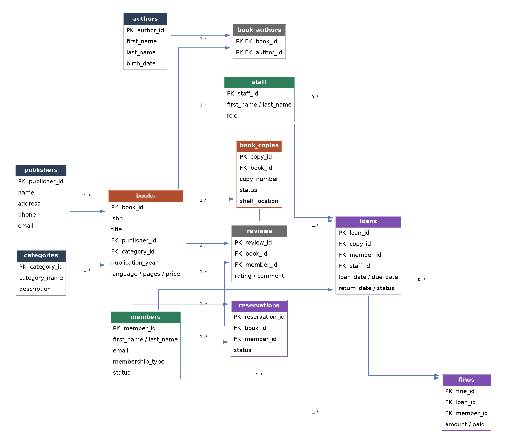

# 📚 Library Management System (PostgreSQL)


A complete library management database built **from scratch, step by step**, on PostgreSQL (Supabase).

> Every piece of this was written and tested manually — not copy-pasted.

---

## 🎯 Project Overview

A library management system I designed and built from the ground up on PostgreSQL — covering book cataloging, member management, borrowing workflows, and automated business rules like fine calculation and loan limits.

While I'd worked with SQL before, this was my first deep dive into PostgreSQL specifically.

### Key design decisions:

- **Separated books from physical copies** (`books` vs `book_copies`) — one book, multiple physical copies with independent status
- **True many-to-many relationship** between books and authors via a junction table (`book_authors`)
- **Business logic enforced at the database level**: a member can't borrow a reserved copy, can't exceed 5 active loans, and is automatically suspended after 3 unpaid fines
- **Automatic fine calculation** on late returns, with protection against negative amounts and `NULL` edge cases

---

## 🗂️ Project Contents

| File | Description |
|---|---|
| `01_schema.sql` | Full database schema: 11 tables, constraints, and indexes |
| `02_functions_triggers.sql` | 4 stored functions, 1 stored procedure, and 4 triggers implementing business logic |
| `03_sample_data.sql` | Realistic sample data: 9 authors (4 modern + 5 classical Arabic literary figures), 20 books, members and staff |
| `04_views.sql` | 6 reporting views |
| `05_advanced_queries.sql` | Advanced analytical queries (CTEs, window functions) |
| `full_database_backup.sql` | Full `pg_dump` export of the live database — schema, data, functions, and triggers in one file |
| `erd.png` | Complete entity-relationship diagram |

**Execution order matters:** run files 01 through 05 in numeric order — triggers must exist *before* data is inserted so they fire correctly from the very first loan.

---

## 🧱 Database Schema (ERD)



**11 tables** organized into 4 logical groups:
- **Catalog:** `authors`, `publishers`, `categories`, `books`, `book_authors`, `book_copies`
- **People:** `members`, `staff`
- **Operations:** `loans`, `reservations`
- **Finance & Feedback:** `fines`, `reviews`

---

## ⚙️ Key Technical Features

### 1) Stored functions enforce real business rules

```sql
SELECT fn_borrow_book(p_member_id => 3, p_copy_id => 12, p_staff_id => 1);
```

`fn_borrow_book` automatically rejects the operation if: the member is inactive, has unpaid fines, already has 5 active loans, or the copy isn't available — each case raised via `RAISE EXCEPTION` with a clear message.

### 2) Triggers keep data consistent with zero manual intervention

- On loan creation → copy status automatically flips to `borrowed` (`AFTER INSERT`)
- On return → copy status flips back to `available`, and a fine is calculated automatically if overdue (`AFTER UPDATE`, comparing `OLD` and `NEW`)
- After 3 unpaid fines → the member's account is automatically suspended

### 3) Historically verified author data

Book-author attributions were fact-checked before insertion (works by Ghazi Al-Qasibi, Taha Hussein, Abdul Rahman Munif, Mikhail Naimy, and classical poets like Al-Mutanabbi, Ibn Hazm, and Qais ibn al-Mulawwah). This led to widening the `publication_year` constraint to accommodate classical works predating the year 1000 CE.

### 4) Advanced analytical queries

Example: top 3 most-borrowed books per category using `ROW_NUMBER() OVER (PARTITION BY ...)`, with careful use of `COUNT(column)` vs `COUNT(*)` alongside `LEFT JOIN` — a critical distinction to avoid incorrect results for books that were never borrowed.

---

## 🚀 Running Locally

```bash
createdb library_db
psql -d library_db -f 01_schema.sql
psql -d library_db -f 02_functions_triggers.sql
psql -d library_db -f 03_sample_data.sql
psql -d library_db -f 04_views.sql
psql -d library_db -f 05_advanced_queries.sql
```

Works on PostgreSQL 14+ (built and tested on Supabase).

---

## 🧠 Skills Demonstrated

`Database Design (3NF)` · `Foreign Keys & Constraints` · `Many-to-Many Relationships` · `PL/pgSQL Functions & Procedures` · `Triggers` · `Window Functions` · `CTEs` · `Indexing` · `ERD Modeling` · `Data Integrity`

---

## 📌 Note

This is a portfolio/learning project demonstrating database design and programming skills. Sample data (members, staff) uses anonymized placeholder names and emails — no real personal information is included.

---

## 📄 License

This project is licensed under the [MIT License](LICENSE) — use, modify, and share freely.